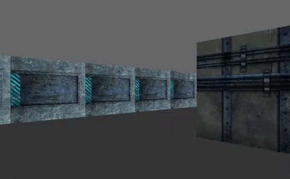

# Wolf3d

## Project Overview

This project is inspired by the world-famous eponymous 90’s game, which was the first FPS ever.



## Installation

```
$> git clone https://github.com/wolf3d && cd wolf3d && git clone https://github.com/libft && make
```

## Usage

Use the mouse to look around and the following keys

| Key     | Action             |
|:-------:|:-------------------|
| W       | move forward       |
| A       | strafe left        |
| S       | move backward      |
| D       | strafe right       |
| Q       | turn left          |
| E       | turn right         |
| P       | pause (free mouse) |
| M       | toggle minimap     |
| esc     | quit               |

## Features
* A simple RayCasted FPS
* Using the SDL2 graphics library
* OpenCL acceleration
